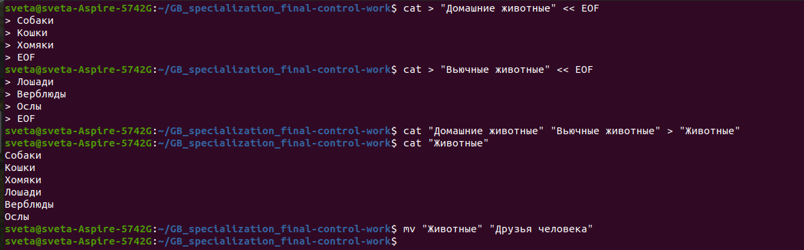
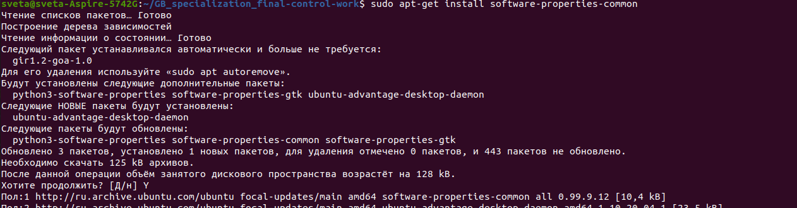
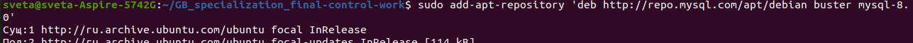
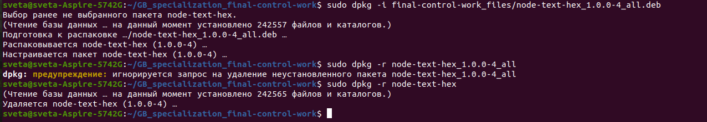
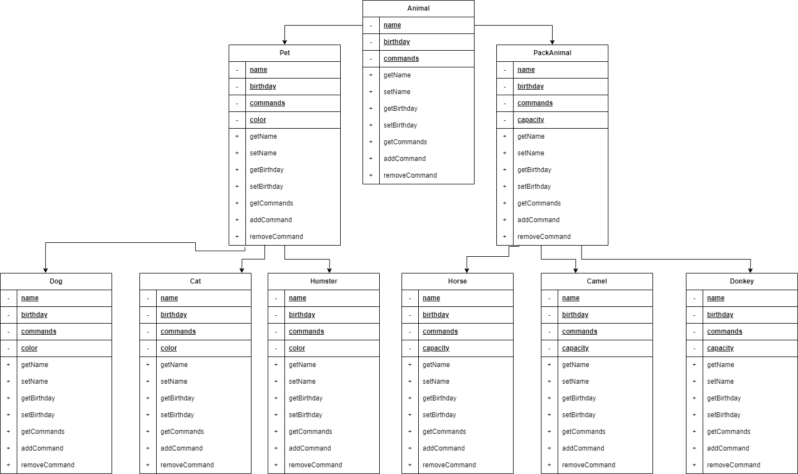

# Итоговая контрольная работа

### 1. Используя команду cat в терминале операционной системы Linux, создать два файла Домашние животные (заполнив файл собаками, кошками, хомяками) и Вьючные животными заполнив файл Лошадьми, верблюдами и ослы), а затем объединить их. Просмотреть содержимое созданного файла. Переименовать файл, дав ему новое имя (Друзья человека).

### 2. Создать директорию, переместить файл туда.

### 3. Подключить дополнительный репозиторий MySQL. Установить любой пакет из этого репозитория.

### 4. Установить и удалить deb-пакет с помощью dpkg.

### 5. Выложить историю команд в терминале ubuntu

<a href="final-control-work_files/task_5_command_history.txt">Файл истории.</a> Из файла удалены команды, которые вбивались до начала выполнения представленной контрольной работы.

### 6. Нарисовать диаграмму, в которой есть класс родительский класс, домашние животные и вьючные животные, в составы которых в случае домашних животных войдут классы: собаки, кошки, хомяки, а в класс вьючные животные войдут: Лошади, верблюды и ослы).

### 7. В подключенном MySQL репозитории создать базу данных “Друзья человека”

<a href="final-control-work_files/task_7-12.sql">Файл sql запросов, строки 1-5.</a>

### 8. Создать таблицы с иерархией из диаграммы в БД

<a href="final-control-work_files/task_7-12.sql">Файл sql запросов, строки 6-93</a>

### 9. Заполнить низкоуровневые таблицы именами(животных), командами которые они выполняют и датами рождения

<a href="final-control-work_files/task_7-12.sql">Файл sql запросов, строки 94-124</a>

### 10. Удалив из таблицы верблюдов, т.к. верблюдов решили перевезти в другой питомник на зимовку. Объединить таблицы лошади, и ослы в одну таблицу.

<a href="final-control-work_files/task_7-12.sql">Файл sql запросов, строки 126-134</a>

### 11. Создать новую таблицу “молодые животные” в которую попадут все животные старше 1 года, но младше 3 лет и в отдельном столбце с точностью до месяца подсчитать возраст животных в новой таблице

<a href="final-control-work_files/task_7-12.sql">Файл sql запросов, строки 135-169</a>

### 12. Объединить все таблицы в одну, при этом сохраняя поля, указывающие на прошлую принадлежность к старым таблицам.

<a href="final-control-work_files/task_7-12.sql">Файл sql запросов, строки 170-190</a>

### 13. Создать класс с Инкапсуляцией методов и наследованием по диаграмме.

<a href="final-control-work_prog/src/model/animal/">Созданы классы в соответствии с диаграммой.</a>
