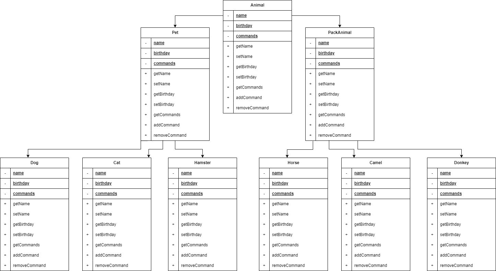

# Итоговая контрольная работа

### 1. Используя команду cat в терминале операционной системы Linux, создать два файла Домашние животные (заполнив файл собаками, кошками, хомяками) и Вьючные животными заполнив файл Лошадьми, верблюдами и ослы), а затем объединить их. Просмотреть содержимое созданного файла. Переименовать файл, дав ему новое имя (Друзья человека).

### 2. Создать директорию, переместить файл туда.

### 3. Подключить дополнительный репозиторий MySQL. Установить любой пакет из этого репозитория.

### 4. Установить и удалить deb-пакет с помощью dpkg.

### 5. Выложить историю команд в терминале ubuntu

<a href="final-control-work_files/task_5_command_history.txt">Файл истории.</a> Из файла удалены команды, которые вбивались до начала выполнения представленной контрольной работы.

### 6. Нарисовать диаграмму, в которой есть класс родительский класс, домашние животные и вьючные животные, в составы которых в случае домашних животных войдут классы: собаки, кошки, хомяки, а в класс вьючные животные войдут: Лошади, верблюды и ослы).

